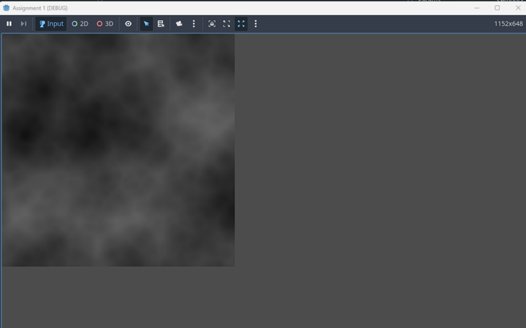

# 🎮 Procedural-Terrain-System-Godot

###  COMP 360 – Game Graphics (Fall 2025)
**Type:** Independent Implementation (Group Assignment)  
**Language:** GDScript  
**Engine:** Godot 4  

---

## 📖 Overview
This project showcases my individual implementation from a group assignment in COMP 360 – Game Graphics.  
I built a Procedural Terrain System in Godot 4 that uses FastNoiseLite to generate 2D heightmaps and 3D terrain meshes procedurally.  
This deepened my understanding of noise functions, mesh construction, and 3D rendering pipelines in real-time environments.

---

## ⚙️ Tech Used
- Godot 4  
- GDScript  
- FastNoiseLite  

---

## 🖼️ Visual Results

| 2D Cellular-Noise Heightmap | 3D Terrain Mesh |
| --- | --- |
|  |  |
| FastNoiseLite, grayscale | Vertex heights sampled from heightmap |

<em>Screenshots from my personal implementation (no source code shared per course policy).</em>

---

## 💡 Key Features
- Generated grayscale heightmaps using **FastNoiseLite** with multiple octaves of cellular noise.  
- Built 3D terrain mesh programmatically with vertex heights sampled from the heightmap.  